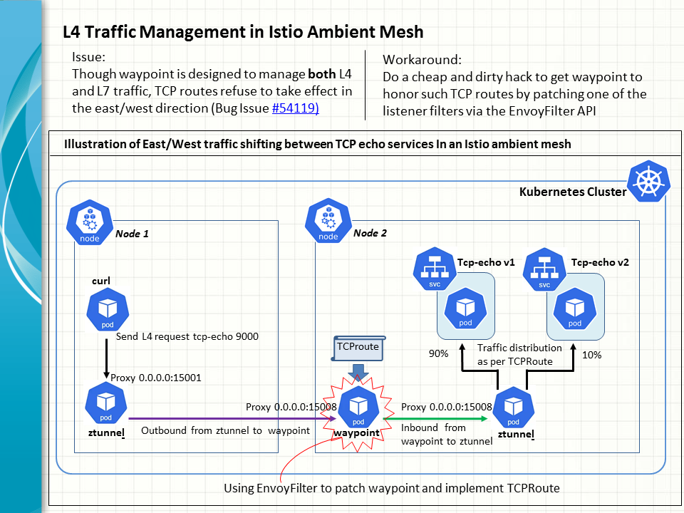

There is a known bug in the Istio ambient mode, where L4 traffic management fails work in the east/west direction or within a mesh. 
More specifically, after creation of such TCP routes, they refuse to take effect on the waypoint concerned, though the latter is 

Let's walk through an example of reproducing a known bug in Istio ambient mesh.
