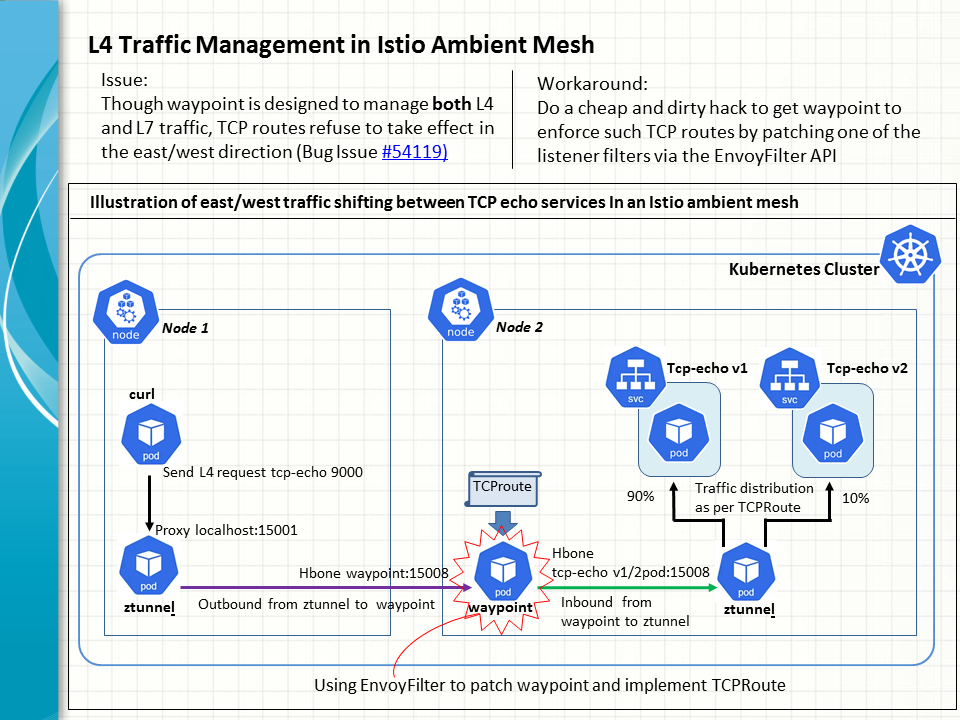

## In-mesh L4 traffic management in the Istio ambient mode

There is a known bug in the Istio ambient mode, where L4 traffic management fails to work inside a mesh, i.e. in the so-called the east/west direction ([Issue 54119](https://github.com/istio/istio/issues/54119)). More specifically, after an application developer creates such a TCP route, the waypoint concerned refuses to honour the traffic rule, though it is obliged by design to manage both the L4 and L7 communucation flows. 

Let's walk through an example of reproducing the bug in an attempt to shift the L4 traffic between two TCP echo service versions. After that, we will introduce a handly but dirty hack to force the waypoint to honour a specific TCP route by patching one of the listener filters through the EnvoyFilter API.



### Limitation

In this example, we use the Kubernetes Gateway API to test out TCP traffic shifting in an Istio ambient mesh. It can be shown elsewhere that the same bug will also happen to the Istio APIs of VirtualService, Gateway and the likes. The crux of the problem is that the L4 traffic management logic simply fails to register with the waypoint, whether configued via the Kubernetes Gateway API or Istio APIs.

### Bug reproduction

The use case refers to the task outlined in the Istio doc, [TCP Traffic Shifting](https://istio.io/latest/docs/tasks/traffic-management/tcp-traffic-shifting/). 

1. First and foremost, ensure the Istio ambient mode is installed with the flag "--set values.pilot.env.PILOT_ENABLE_ALPHA_GATEWAY_API=true". Assume the Isto version is 1.24.0.
```
cd istio-1.24.0
export PATH=$PWD/bin:$PATH
istioctl install --set values.pilot.env.PILOT_ENABLE_ALPHA_GATEWAY_API=true --set profile=ambient --skip-confirmation
```


